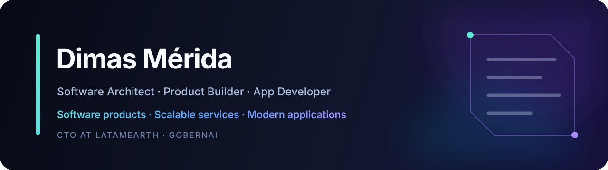

 

## About me

I design and build **scalable services, developer tools, SaaS platforms, and AI-native systems**. I have a strong foundation in software architecture and turn complex product ideas into maintainable systems through clear boundaries, explicit contracts, and pragmatic technical decisions.

- Designing services that can evolve and scale without losing maintainability
- Building primarily with **TypeScript, Bun, React, Next.js, Supabase, and PostgreSQL**
- Working with coding agents such as **OpenCode, Codex, Antigravity, and Claude Code**
- Exploring persistent context, orchestration, and communication between **humans and AI agents**
- Applying **DDD, hexagonal architecture, vertical slices, and ports & adapters** where they add real value
- Serving as **CTO at LatamEarth** and contributing to the development of **GobernAI**

## Currently building

<table>
<tr>
<td width="50%" valign="top">

### [DotAgents](https://github.com/leomerida15/dotagents)

A bridge for synchronizing agent context and configuration across IDEs, extensions, and terminal-based AI tools.

`AI agents` · `Bun` · `TypeScript` · `CLI`

</td>
<td width="50%" valign="top">

### [Bunstart](https://github.com/leomerida15/bunstart)

A CLI and toolkit for initializing projects and managing Bun-based TypeScript monorepos.

`Bun` · `Monorepos` · `Developer tooling`

</td>
</tr>
<tr>
<td width="50%" valign="top">

### [Supabase Kit](https://github.com/leomerida15/supabase-kit)

Developer tooling and reusable building blocks for Supabase applications and workflows.

`Supabase` · `PostgreSQL` · `TypeScript`

</td>
<td width="50%" valign="top">

### GobernAI

An AI-native initiative built around structured workflows, software agents, and scalable services.

`AI-native systems` · `Software agents` · `Scalable services`

</td>
</tr>
</table>

## Technology focus

## AI agent toolkit

I use coding agents as part of the complete engineering workflow: product planning, architecture, implementation, testing, documentation, and review.

## Engineering approach

- Model the domain before choosing abstractions.
- Keep business rules independent from frameworks and infrastructure.
- Use automated tests as part of the definition of done.
- Design explicit contracts between modules, services, and agents.
- Build services with scalability, observability, and operational evolution in mind.
- Prefer simple systems that can evolve over premature complexity.

---

**Open to collaborating on developer tools, SaaS platforms, and AI-native systems.**

[Start a conversation](mailto:leomerida15@gmail.com)

